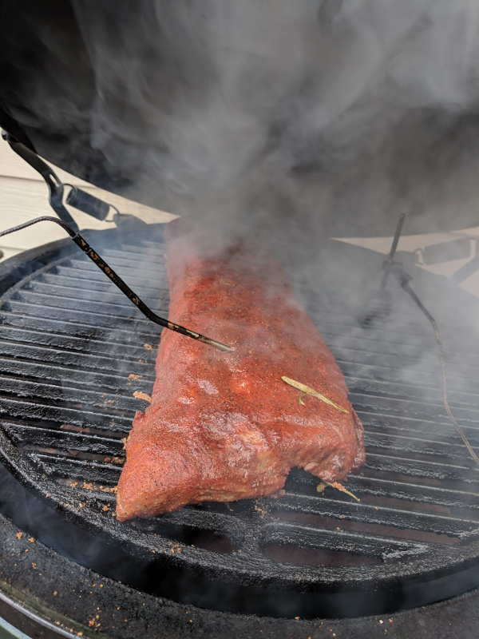

# Moonbas3 St. Louis Style Barbecue Ribs

{.align-center}

## Required Equipment

- Smoker or barbecue that can smoke..

## Discussion

I developed this recipe over several iterations of cooking ribs. This
works for both baby back and St. Louis (spare) ribs style ribs. The only
difference is baby backs will cook in about 3-4 hours versus spare ribs
taking 5-6. I start checking in on them about 1 hour before I anticipate
it being done and sometimes sooner depending on how well I am managing
smoking temperatures. The sauce is my competition sauce, which is one of
my favorites without a doubt. Anyone who has gone to Fowler's Fourth of
July blow out has had this a few times and I've never gone home with any
leftovers..

Because of the dimensions of the ribs and the locations of their meat,
it is difficult to cook to temperature. I have tried multiple times (see
image for my probing schema) and have gotten wildly different results
depending on where I put the probes, the average distance between bones,
and the striation of meat. Now, I just cook to time (3 hours for baby
backs, 4 hours for spares) before I begin testing for doneness.
Generally, I can just look at the tips of the bones and know how long I
have left, but I will be the first to admit it is a "skill" and takes a
few iterations to learn well.

## Ingredients

Rub makes the world go round, sauce finishes the journey.

### Rub

- 1 cup firmly packed, dark-preferred, brown sugar
- 1 cup white sugar
- 1/2 cup smoked paprika
- 1/4 cup garlic powder
- 2 tbsp kosher salt (fine ground)
- 2 tbsp black pepper
- 2 tbsp ground ginger
- 2 tbsp onion powder
- sliced and diced rosemary sprigs (1-2)

### Sauce

- 1 cup ketchup
- 3 tbsp dark brown sugar
- 3 tbsp apple cider vinegar
- 2 tsp chili powder
- 1 tsp dry mustard powder
- 1 tsp black pepper
- 1/2 tsp kosher salt
- 1/2 tsp onion powder
- 1/2 tsp garlic powder
- 1/4 tsp cayenne pepper (more if you like spice)
- (optional) 1/2 cup of water, if going to heat or like a bit less
 sticky sauce.

## Directions

### Making the rub

1. Put all ingredients into a bowl and mix thoroughly.
2. Pat dry the ribs.
3. Apply by hand or through a shaker to the ribs directly.
4. Pat in the rub and let sit 5 minutes.
5. Repeat step 3 and step 4 again.
6. (Optional) Put aside in refrigerator for 2-16 hours depending on if
 you can cook today.

### Making the Sauce

1. Put ketchup in measuring cup.
2. Put the rest of the ingredients on top of the ketchsup.
3. Mix thoroughly.
4. Add salt to taste.

### Cooking the Ribs

0. Realize you will be smoking for about 5-6 hours, so plan wood and
 charcoal accordingly.
1. I use a 50/50 mix of lump charcoal and hickory or cherry wood when
 doing ribs. I have a big green egg-style smoker, so I fill up the
 charcoal basin \~75%.
2. Be sure you have indirect heat, as direct heating ribs is a bad
 idea.
3. (Optional) I use a drip pan that I initially fill with \~2 cups of
 water, this will last about 3 hours and need to be refilled.
4. Build fire slowly, coast your smoker up to \~230F.
5. Put on ribs so they are shielded by your indirect heat zone.
6. Close lid and do not open for 4 hours (or 3hrs if cooking baby
 backs).
7. Ribs will be "done" when they pass a few criteria:
8. Ribs will have pulled back from the bone about 1\".
9. Ribs will pass the twist test (grab with tongs and twist, they
 should almost separate and flake).
10. If not done, wait 20 minutes and try again.
11. (Optional but tasty) Take ribs off smoker, remove indirect heating
 blocker or scatter charcoal to create a direct heat zone, then put
 sauce on ribs directly and cook each side for 90 seconds over open
 flame. This will caramelize the sugar in the sauce and give a great
 smoky flavor to your hard-won bark.

Enjoy!
