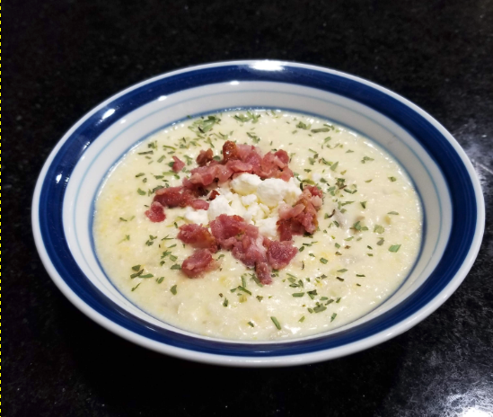

# dis0wn's Two-Cheese Bacon Potato and Cauliflower Soup

My variation of a traditional Irish soup. Serve with a hearty bread to dip. 

## Ingredients

- 1-2 Tbsp Butter
- 1/2 pound of bacon. Cooked and chopped finely. European-style bacon tends to be more lean.
- 1 cup of chopped onions, pick your fav
- 2 cloves of garlic, roasted and chopped fine. add more if you like garlic. See below for roasted garlic recipe.
- 5 cups of whole milk, 2% and skim won't work here. Sub in 1 cup of heavy whipping cream for thickness.
- 1 pound of potatoes, peeled and diced.
- 1 pound of cauliflower
- 1.5 cups of shredded sharp cheddar cheese (I prefer extra sharp)
- 1/2 cup crumbled feta cheese
- 1 Tbsp Tarragon
- 1.5 Tsp of salt

## Instructions

1. Melt the butter in a large sauce or pasta pan over medium-high heat. If the butter starts getting dark, it's too hot. turn it down. Add onion. Cook for 5-6 minutes, stirring frequently. 
2. Add garlic and stir for a minute. Add milk, cauliflower, potatoes, and salt. Bring to a boil. Stir occasionally 
3. Reduce heat to low, cover and simmer for 15 minutes or until potatoes are tender. Stir occasionally but be sure to scrape the bottom of the pan to get the tasty bits of onion and garlic into the mix.
4. Working 2 cups at a time, process the soup in a food processor or blender. Optionally, you can use a stick blender and leave it in the pan. Blend until smooth. Return it to the saucepan and heat it through over a medium heat. 
5. Remove from heat and stir in cheddar cheese and half of the feta. Stir until melted. 
6. Ladel into a bowl for serving. Sprinkly tarragon over the top. Place a small amount of feta in the middle and sprinkle bacon over the top. 

## Roasted Garlic
1. Pre-heat oven to 375F
2. Cut just the top off the garlic bulb. 
3. Place bulb on a small sheet of aluminum foil and drizzle olive oil over the top. Try to let it soak into the middle of the bulb.
4. Close the foil around the bulb and place it in the oven on a cookie sheet or right on the rack. 
5. Bake for about an hour. 
6. Remove from foil and remove all the garlic casings. Squeezing from the bottom of the clove will usually allow the garlic meat to come out in one piece. 
7. Keep in a tupperware in the fridge. Good for several weeks. Add olive oil if it starts to dry out.
